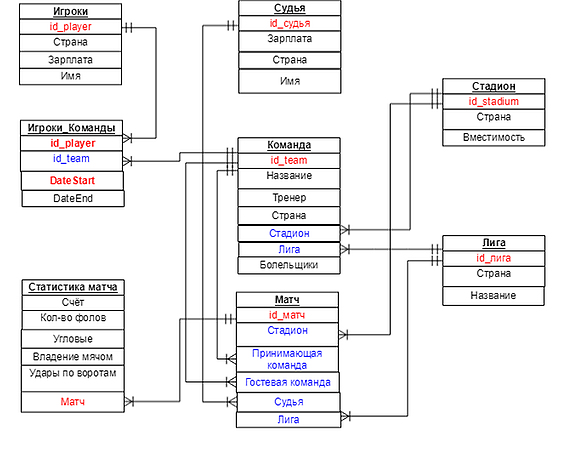
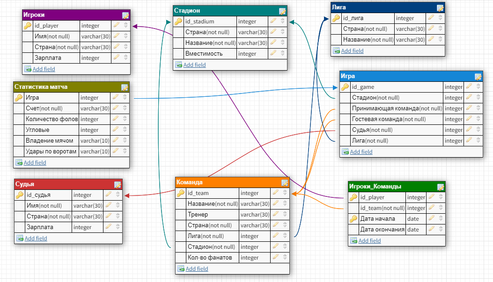

# База Данных - Футбольный турнир

### ER-модель

 `PRIMARY KEY`

 `FOREIGN KEY`

### Логическая модель

### Описание таблиц
 1. Лиги, в которых играют футбольные команды.
 
 Поля в таблице : id(PK); страна; название лиги.
 Каждая команда состоит только в одной лиге.
  В данной таблице 5 полей.
  
  '''SQL
  Create Table();
  '''
 
 2. Стадионы, на которых играют команды.
 
 У каждой команды есть свой стадион. 
 Содержит поля : id(PK); имя стадиона; страна; вместимость стадиона.
 В данной таблице 7 полей.
 
 3. Команды, которые участвуют в турнире.
 
 Содержит поля : id(PK); название; Имя тренера; Страна; Стадион(FK); Лига(FK); Кол-во фанатов.
  В данной таблице 7 полей.
 
 4. Игроки, участвующие в турнире.
 
 Содержит поля : id(PK); имя игрока; Страна, из которой игрок родом; зарплата.
  В данной таблице 14 полей.
 
 5. Судьи, которые принимают участие в матчах турнира.
 
 Содержит поля : id(PK); Зарплата; Страна; Имя.
  В данной таблице 4 поля.
 
 6. Матчи, проходящие на данном турнире.
 
 Содержит поля : id(PK); Стадион(FK); Команда, играющая на своём стадионе(FK); Гостевая команда(FK);
 Судья(FK); Лига(FK).
  В данной таблице 3 поля.

 7. Статистики матчей, проводящихся на турнире.
 
 Содержит поля : Счёт; кол-во фолов; кол-во угловых; владение мячом(%); удары в створ ворот; Игра(PK).
  В данной таблице 3 поля.

 8. Таблица-связка между игроками и командами.
 
 Содержит поля : id_player(PK), id_team(FK), Дата начала контракта игрока с клубом(PK); 
 Дата окончания контракта с клубом.
  В данной таблице 14 полей.

### Описание запросов
 
 1. Запрос выводит счёт матча; id-команд-участниц; Лигу; кол-во фолов и угловых за игру.
 
 Этот запрос нужен для получения полной информации по сыгранным матчам.
 
 2. Запрос выводит Игрока с зарплатой выше среднего в его команде; его команду; его зарплату.
 
 Этот запрос нужен для понимания, какие игроки являются высокооплачиваемыми в клубе. 
 В дальнейшем это может помочь руководству соотности полезность и зарплату для продления
 или расторжения контракта.
 
 3. Запрос выводит счёт в матчах, где судил русский судья.
 
 Этот запрос показывает зрелищность матчей, где судит судья из России.

### Описание триггеров

 1. Триггер, который при добавлении в таблицу нового стадиона, сразу добавляет его в команду.
 
 ### Описание функций 
 
 1.  Функция на вход принимает id_team, а возвращает её название.
 
 Очень часто нужно знать именно название команды, а не id.
 
 2.  Подаётся на вход id_team. Функция возвращает имена игроков этой команды и их страны.
 
 Функция нужна для понимания, насколько команда мильтинациональная. В некоторых лигах
 существует правило лимита на легионеров. Эта функция может показать превышен ли лимит.
